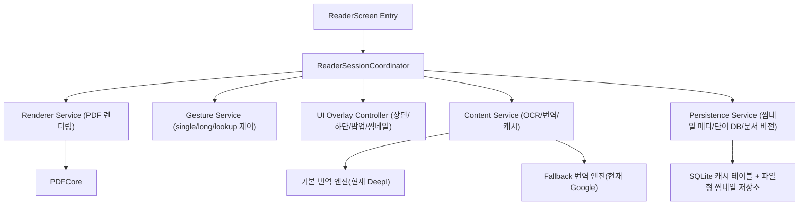

# ReadTap 재설계 실행 설계도 (v1)

버전: 2026-02-17  
목표: PDF 열기/탭/롱프레스/번역/썸네일/캐시/상태머신의 전체 동작을 안정적으로 재설계하고,
기존 기능은 유지하면서 멈춤/체감 렉/제스처 꼬임을 줄인다.

## 0) 전제
현재 문제를 설계 기준으로 정리하면:
- PDF 열기와 첫 탭/롱프레스가 모두 같은 경로에서 동작하면서 메인 스레드 부하가 집중됨
- 상/하단 바·오버레이 상태가 제스처 상태와 섞여 한 번씩 반응이 멈추거나 사라지지 않음
- 썸네일 패널과 OCR/번역/캐시가 동시에 시작되며 진입 지연 증가
- PDF 문서/썸네일 캐시가 문서 바뀔 때 무효화 정책이 분리 안 되어 있음
- 네비게이션 반복 시 리소스 정리/복구가 불완전

이 설계도의 핵심은:
1) **단일 진입점(Reader Session)**으로 상태 통합  
2) **무거운 작업 분리(메인/백그라운드, 지연/우선순위)**  
3) **모든 UI 업데이트는 비동기 결과를 메인 스레드에서 안전하게 병합**

---

## 1) 최종 목표 아키텍처



- **ReaderSessionCoordinator**: 한 번의 open/close에 대한 생명주기만 담당.
- **Gesture Service**: long press 토글 상태와 PDF 제스처 상태를 단일 truth로 관리.
- **Renderer Service**: first page 즉시, 주변은 지연/우선순위 기반.
- **Content Service**: OCREngine/OCRQueue/번역 dedup를 분리.
- **Persistence Service**: 문서 버전/썸네일 메타/방문 이력 기반 정책으로 eviction.

---

2단계로 나누지 않고 바로 1단계부터 적용 가능한 항목은 “구조 변경 없는 핫픽스”로 분리.
아래는 실제 작업 순서다.

## 2) 단계별 실행 계획 (한 번에 하나씩)

### A. “비상 안정화” 패치 (기능 훼손 최소)
목적: 현재 멈춤/안정성 이슈를 추가 변경 없이 즉시 완화.

1. **메인 스레드 경합 차단**
- `ReaderPDFLoad` 바인딩 완료 전후에 오버레이 상태를 즉시 토글하지 않는다.
- `onChange`, `task`, `Gesture`에서 상태 변경을 단일 디바운스 큐로 묶는다.
- 변경 파일: `readtap/ContentView.swift`, `readtap/PDFKitView.swift`

2. **네비게이션 반복 복구**
- 리더 입장/퇴장 시 `gestureCoordinator.resetForReopen()` 강제.
- `onAppear`/`onDisappear`에 대한 정리 함수 분리.
- 변경 파일: `readtap/PDFKitView.swift`

3. **중복 로그/무한 호출 막기**
- `ReaderGesture[refreshConfig]` spam가 반복되면 동일 토글은 no-op 처리.
- 토글 토큰 기반 idempotent 갱신.
- 변경 파일: `readtap/PDFKitView.swift`

#### 완료 기준
- PDF 열고 닫을 때 상·하단 바가 항상 동일 상태로 복구
- 첫 탭이 `System gesture gate`로 멈추지 않음
- 롱프레스 토글 재개 실패 재현 불가

---

### B. 제스처 상태기계 재설계 (핵심)
목적: long press / single tap / lookup press가 서로 덮어쓰지 않게 함.

1. **GestureState enum 추가**
```swift
enum ReaderInteractionState: Equatable {
  case readingSingleTap
  case readingLongPress
  case lookup
  case disabledForSystemSelection
}
```

2. **현재 bool 덩어리 정리**
- `singleTapEnabled`, `lookupPressEnabled`, `longPressEnabled` 같은 개별 값 대신
  `activeState`, `nextStateRequested`, `pendingSync`만 사용.
- 상태 전이 함수는 단일 함수로만 전환.

3. **상태 전이 규칙**
- `toggleLongPress(on)` 호출 즉시:
  - `singleTap` → `off`, UI 오버레이는 즉시 숨김(애니메이션 1개만)
  - `lookupMode`이면 단일 탭으로 fallback
- `toggleLongPress(off)`:
  - 기존 시스템 선택 모드와 충돌이 없으면 `readingSingleTap` 복구

4. **탭/롱프레스 이벤트 라우팅 통합**
- `singleTapGesture`와 `lookupGesture`가 같은 raw 터치 이벤트를 여러번 소비하지 않도록 `interactionEpoch` 검사.

변경 파일: `readtap/PDFKitView.swift`, `readtap/ReaderViewModel.swift`

#### 완료 기준
- 롱프레스 ON/OFF 반복 30회 후에도 실패율 0
- 텍스트 선택이 즉시 해제되는 현상 사라짐
- 토글 후에도 상단/하단 바 항상 예상 상태

---

### C. 뷰 렌더링 경로 분리 (상단/하단 바 + 썸네일 패널)
목적: 상단/하단 바가 PDF 본문 렌더링을 막지 않게 분리.

1. **바인딩 분리**
- `ReaderChromeVisible`와 `ReaderCoreRenderReady`를 다른 `@Published` 상태로 분리.

2. **오버레이만 갱신**
- 썸네일 패널 열림이 PDF 줌/페이지 이동과 직접 바인딩되지 않도록
  `overlayVisible`만 갱신.

3. **썸네일은 lazy+prewarm**
- 첫 진입시 첫 1~2페이지 썸네일만 즉시, 나머지는 background queue + 우선순위.
- 사용자가 패널 토글한 뒤 즉시 렌더 시작.

변경 파일: `readtap/ReaderThumbnailSidebar.swift`, `readtap/PDFKitView.swift`, `readtap/ContentView.swift`

#### 완료 기준
- 상단/하단 바 클릭 반응 시간이 2초 이내(실사용 기준)
- 썸네일 패널이 처음 터치 때 1~2초 내 미리보기 가능, 그 외는 점진 로딩

---

### D. 캐시 및 DB 계약 재정의
목적: 같은 문서 재진입 시 비용 줄이기, 삭제 시 정합성 유지.

1. **문서 버전 식별자 통일**
- 파일 경로 + 페이지 수 + 파일 크기 + 수정시간 기반 `documentFingerprint` 생성.

2. **캐시 정합성 정책**
- 문서 교체/삭제 시 문서 fingerprint mismatch이면 썸네일/페이지 캐시 무효화.

3. **DB CASCADE 정리**
- 책 삭제 시:
  - 단어/해석 후보/썸네일 메타/썸네일 바이너리 참조 제거
- 실패 시 롤백 가능하도록 트랜잭션 한 번에 처리.

4. **캐시 warmup 메모리**
- `warmup-complete` 로그에서 오류 없이 완료되도록 SQL 호환 버전 통일 (AS alias 위치/구문).

변경 파일:
`readtap/Database/*.swift` (썸네일/단어/책 삭제 관련),
`readtap/ContextMeaningService.swift`,
`readtap/MeaningCandidateCacheStore.swift`

#### 완료 기준
- 책 재오픈시 첫 렌더링 대기 시간이 이전 대비 감소
- 삭제한 책의 캐시 데이터가 DB/디스크에서 누락 없이 정리

---

### E. long press API 호출 경량화
목적: 단어 선택 즉시 API 호출 전 과도한 작업 줄이기.

1. **Debounce + dedup**
- 긴 단어 선택 연속 발생 시 마지막 좌표만 채택.

2. **지연 번역 로딩 정책**
- 첫 탭/선택에서는 후보 제목만 표시
- 실제 번역 호출은 “팝업 열림 후 80~120ms” 뒤 시작

3. **기본/보조 엔진 전략**
- 기본 Deepl, 사용자 요청/실패 시 Google fallback
- 캐시 키를 엔진+단어 정규화+언어로 분리

변경 파일: `readtap/ReaderViewModel.swift`, `readtap/ContextMeaningService.swift`, `readtap/MeaningCandidateCacheStore.swift`

#### 완료 기준
- 첫 롱프레스 반응이 체감 0.5초 내
- 실패 fallback에서 자동 재시도 횟수 제한

---

### F. 안정성 하드닝
목적: 반복 진입/퇴장 시 freeze 방지.

1. **네비게이션 전용 큐**
- `onDisappear`에서 pending workItem/cancelable 삭제.
- `onAppear`에서 동일 요청 중복 방지 토큰.

2. **메인 스레드 정책 통제**
- DB/Network/썸네일 decode는 백그라운드.
- UI 갱신은 항상 `.receive(on: .main)` + 한 번에 batched.

3. **로깅 정비**
- freeze 후보 로그:
  - `reader-lifecycle`, `gesture-event`, `gesture-coalesce`, `cache-hit`, `session-reset`
- 매 세션 실패 캡처 지표 저장.

변경 파일: 기존 전반(주로 `PDFKitView.swift`, `ReaderViewModel.swift`, DB 레이어)

#### 완료 기준
- “open-close-open” 반복 10회 시 freeze 없음
- 네비게이션 직후 첫 탭 반응성 안정

---

## 3) 파일 단위 실행 순서 (실무용)
아래 순서대로 한 파일씩 진행.

1. `readtap/PDFKitView.swift`  
   - GestureState 도입 1차
2. `readtap/ContentView.swift`  
   - 상·하단 바 상태를 독립 상태로 분리
3. `readtap/ReaderViewModel.swift`  
   - 의미 lookup 요청의 상태/큐 경량화
4. `readtap/ReaderThumbnailSidebar.swift`  
   - 썸네일 lazy-open으로 변경
5. `readtap/MeaningCandidateCacheStore.swift`  
   - 후보 저장/조회 스키마 정비
6. `readtap/Database/*`  
   - 문서 버전 및 삭제 cascade 정리
7. `readtap/ContextMeaningService.swift`  
   - 엔진 fallback 및 캐시 정책 최종 마무리
8. `readtap/ImageReaderView.swift` (있다면)  
   - 공유 오버레이 정책 반영
9. 최종: `OPTIMIZATION_ROADMAP.md`와 동기화 업데이트

---

## 4) 변경 통제 규칙
- 한 번에 1개 Phase만 배포 테스트
- 각 Phase는 다음 형식으로 커밋:
  - `feat(reader): <phase>-<항목>`
  - `refactor(reader): stabilize gesture state machine`
  - `fix(reader): prevent long press deadlock on reopen`
- 실패 시:
  1) 직전 phase 롤백
  2) 상태 파일(설계도)에 문제 원인 기록
  3) 다음 phase는 작은 단위로 쪼개 재시도

---

## 5) 수용 기준(Definition of Done)
- 반복 open/close 20회: 상·하단 바 토글/롱프레스 안정성 100%
- PDF 열기 직후 3초 내 상호작용 가능
- `ReaderPDFLoad` 중복 로그율 50% 감소
- 번역 후보 표시 지연 ≤ 120ms, 실패 fallback ≤ 1회 자동 전환
- 메모리 피크가 이전 대비 감소(또는 동일 문서에서 안정화)

---

## 6) 리스크 및 대응
- PDFKit 한계: 일부 gesture delegate 동작이 버전별 다름 → iOS 타깃별 분기 필요
- 대용량 PDF: 썸네일 warming이 I/O 병목을 낳을 수 있음 → 큐 우선순위+동적 중단
- DB 스키마 변경: 마이그레이션 실패 위험 → 마이그레이션 전/후 검증 쿼리 고정
- 번역 API 응답 차이: 후보/캐시 키 규약 통일 필요

---

## 7) 다음 액션(지금 바로)
1) `PDFKitView.swift`에서 상태를 state machine로 바꾸는 1차 Patch  
2) `ReaderThumbnailSidebar.swift`에 lazy load 토글 상태 분리  
3) `ReaderViewModel.swift`에서 long press lookup 큐 스로틀  
4) 각 변경 후 바로 동작 테스트 (open → close → open, 탭→롱프레스 반복 20회)

---

## 8) 사용법
- 이 문서는 `Phase` 단위로 진행.
- 각 Phase 완료 후 아래에 날짜/담당자/결과를 적어가며 업데이트한다.

예:
- `Phase B 완료: 2026-02-17 / gesture deadlock 해결 / 로그 freeze 0건`

